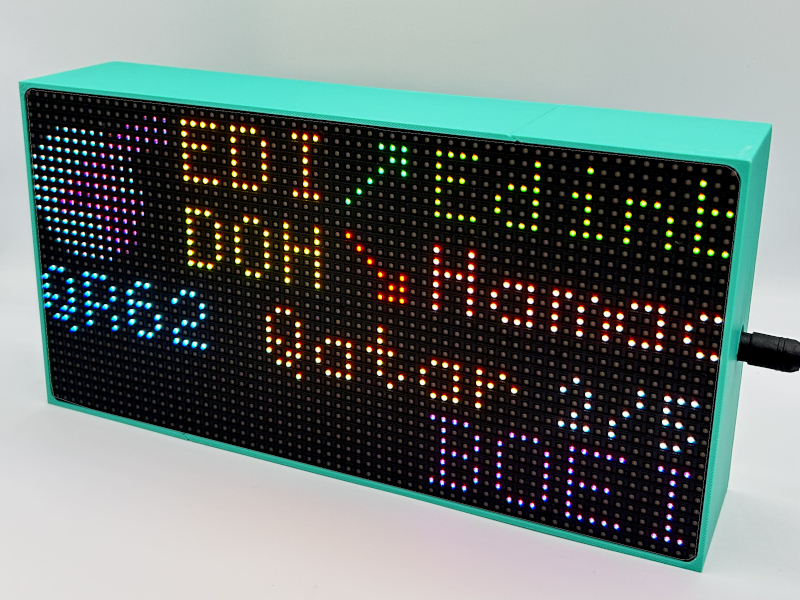

# Raspberry Pi Flight Tracker (v2) [](https://github.com/ColinWaddell/FlightTracker/actions/workflows/lint.yml)

[](https://blog.colinwaddell.com/user/pages/01.articles/02.flight-tracker/screen-flight-thumb.jpg)

A Raspberry Pi-powered RGB LED matrix that shows you what aircraft are overhead. It sits on your fridge, or a shelf, or wherever you decide to put it, and quietly answers the important question: **"What's that plane?"**

FlightTracker takes live aircraft data, works out what is nearby, and displays it on a 64x32 RGB LED matrix. When there's nothing overhead, it shows the time, weather, temperature, rainfall, or satellite passes.

For much more detailed documentation, visit [colinwaddell.github.io/FlightTracker](https://colinwaddell.github.io/FlightTracker).

 - [Hardware: Build your own](https://colinwaddell.github.io/FlightTracker/build/)
 - [Software: Install and configure](https://colinwaddell.github.io/FlightTracker/install/)

---

## Support Me

I've been working on this project for 5 years now, nearly every day, helping users and adding new features. If you'd like to show your support visit [ko-fi.com/flighttracker](https://ko-fi.com/flighttracker)

---

## v1 to v2

Recently (June 2026) this codebase has had a major rewrite. There are detailed guides on the update procedure but it's worth pointing out the change in branching:

 - `main` is the new home for FlightTracker `v2`
 - `master` is the resting place of FlightTracker `v1`

## Installation

### Quick install

Choose the script for your hardware and run it over SSH on a fresh Raspberry Pi OS (Lite) install:

```bash
# Raspberry Pi 3 / 4 / Zero
curl -sSL https://raw.githubusercontent.com/ColinWaddell/FlightTracker/refs/heads/main/platforms/pi/install.sh | bash

# Raspberry Pi 5
curl -sSL https://raw.githubusercontent.com/ColinWaddell/FlightTracker/refs/heads/main/platforms/pi5/install.sh | bash
```

Each installer detects your hardware, clones the repo, sets up the Python environment, and configures a systemd service so FlightTracker starts on boot. Each script will redirect you to the correct one if it detects it's running on the wrong platform.

### Step-by-step install

If you'd rather do it manually - or you want to understand what the script does - follow the guide for your platform:

| Platform | Guide |
|----------|-------|
| Raspberry Pi 3 / 4 / Zero | [platforms/pi/INSTALL.md](platforms/pi/INSTALL.md) |
| Raspberry Pi 5 | [platforms/pi5/INSTALL.md](platforms/pi5/INSTALL.md) |
| Desktop simulator | [platforms/simulator/INSTALL.md](platforms/simulator/INSTALL.md) |

## 3D Printed Case

There's an official 3D-printable case for FlightTracker, designed for the 64×32 HUB75 RGB LED matrix (4mm pitch). It's a two-piece interlocking design that works with any Raspberry Pi model and prints on a normal-sized bed with minimal supports.

- Ready-to-print files on [Printables](https://www.printables.com/model/1820229-flight-tracker-screen-for-raspberry-pi-any-model-6)
- OpenSCAD source and assembly instructions on [GitHub](https://github.com/ColinWaddell/FlightTracker-Case)



---

## Optional features

### Loading LED

An LED wired to a GPIO pin can blink while flight data is loading. Enable it in the web UI under Hardware settings, and set the GPIO pin number to match your wiring.

### Rainfall chart

If you have a WeatherAPI key configured, you can display a 24-hour rainfall chart alongside the temperature. Set the weather mode to "temperature + rainfall" in the web UI.

[](https://raw.githubusercontent.com/ColinWaddell/FlightTracker/refs/heads/main/assets/weather.jpg)

### Using a local ADS-B receiver (tar1090)

By default the tracker pulls flight data from FlightRadar24. If you run your own ADS-B receiver with [tar1090](https://github.com/wiedehopf/tar1090) or a compatible [PiAware](https://www.flightaware.com/adsb/piaware/) / [dump1090-fa](https://github.com/flightaware/dump1090) setup, you can use that as your data source instead - no FlightRadar24 account or API access required.

#### What you need

- A device running dump1090-fa, readsb, or similar, with tar1090 installed
- The device must be reachable on your local network from the Flight Tracker Pi
- tar1090-db enrichment active (the default in most installations) - it provides the aircraft type descriptions used by this software

#### Finding your aircraft.json URL

Try each of the following in your browser, replacing `your-receiver` with your device's hostname or IP address, until you get a response containing a list of aircraft:

```
http://your-receiver/tar1090/data/aircraft.json
http://your-receiver:8080/data/aircraft.json
http://your-receiver/dump1090-fa/data/aircraft.json
http://your-receiver/skyaware/data/aircraft.json
```

The response should be a JSON object with an `"aircraft"` array.

#### Enabling tar1090 as your data source

Once you have the URL, enter it in the web UI under the ADS-B / tar1090 settings. The tracker will automatically use your local receiver when a URL is configured, and fall back to FlightRadar24 if it is not.

#### Differences from FlightRadar24 mode

- Aircraft type (e.g. "Airbus A-320") is sourced directly from the tar1090 aircraft database
- Origin and destination airport codes are looked up via [adsbdb.com](https://api.adsbdb.com)
- All position and altitude data comes from your receiver in real time
- No rate limiting or API key required

### Using OpenSky Network as your data source

[OpenSky Network](https://opensky-network.org) is a free, community-driven ADS-B network that can replace FlightRadar24 as the flight data source. No subscription is required - a free registered account gives you enough API credits for 30-second polling.

#### What you need

- A free account at [opensky-network.org](https://opensky-network.org)
- An API client created under Account -> API Clients (gives you a Client ID and Client Secret)

#### Enabling OpenSky Network

1. Log in to the FlightTracker web interface
2. Under **Data Source**, select **OpenSky Network**
3. Enter your **Client ID** and **Client Secret**
4. Save - the tracker will restart and begin fetching from OpenSky

#### Differences from FlightRadar24 mode

- Uses OAuth2 credentials (Client ID + Client Secret) rather than a third-party library
- Aircraft type and route origin/destination are both looked up via [adsbdb.com](https://api.adsbdb.com), the same service used in tar1090 mode
- If your credentials are invalid the display will show `KEY ERROR` as the callsign rather than going blank
- Data refreshes every 30 seconds

---
## Satellite Tracking

To see when a particular satellite is over head enter its [NORAD ID](https://celestrak.org/SATCAT/search.php) in the device config and it'll let you know where to look, its altitude and speed.

## Running the tracker from the command line

The main entrypoint is the script at the repo root:

```bash
cd /home/pi/FlightTracker
source env/bin/activate
python3 flight-tracker.py help
```

The CLI supports a small set of commands for configuration and maintenance:

```text
Usage: python flight-tracker.py [command]
Commands:
  config                 Dump current configuration as JSON
  data                   Print the platform data directory path
  reset password         Clear web_password_hash in the config
  reset settings         Delete the config.json file
  cache clear            Wipe all on-disk cache files (routes and TLE)
  interface enable       Enable the web interface in the config
  interface disable      Disable the web interface in the config
  test overhead_fr24     Test FlightRadar24 data source
  test overhead_tar1090  Test tar1090 data source
  test overhead_osn      Test OpenSky Network data source
  test tle               Test TLE satellite lookup
  help                   Show this help message
  --version              Print the program version
```

Test commands accept `--parameters` and `--interval`/`--limit` for repeated runs. Run `python flight-tracker.py test <target> --help` for details.

For normal operation, start the tracker with `python3 flight-tracker.py` and use the configuration file or the web settings UI to control its behaviour.

---

## Updating to the most recent version

If your checkout is still on the old `master` branch, switch to `main` before pulling updates:

```bash
cd /home/pi/FlightTracker
git fetch --all
git checkout main
git pull
source env/bin/activate
pip install -r platforms/pi/requirements.txt
sudo systemctl restart FlightTracker.service
```

---

## Troubleshooting

- **The installation went well, you selected Convenience Mode (no soldering) and can't see anything:**
   Head into the settings interface and go into the `Hardware` section and select Convenience Mode
   for a second time, then hit save.

- **Only the top half of the screen is lit up:**
  Check the panel you've bought to see if it says `32S` (1:32 scan rate) anywhere on it. These aren't supported by this code
  yet but it should be an easy fix - [more details here](https://github.com/ColinWaddell/FlightTracker/issues/73). If you get it working
  let me know in the ticket as I want to add this to the settings page.

- **Everything looks red**:
  Your power supply isn't supplying enough power to the screen.

- **I changed a setting now the deice wont start:**
  Reset your settings by deleting your config and rebooting

```bash
# Before v2.3.0
rm ~/.local/share/FlightTracker/config.json
sudo reboot

# After v2.3.0
cd ~/FlightTracker
source env/bin/active
python flight-tracker.py reset settings
```

- **Everything is broken and it wont boot:**
  [Raise a ticket](https://github.com/ColinWaddell/FlightTracker/issues/new?template=bug_report.yml) and tell me what you can see. The most useful info comes from trying to run it manually like this:

```bash
# Disable the service
sudo systemctl stop FlightTracker.service

# Get ready to run the code
cd ~/FlightTracker
source env/bin/activate

# Copy the output of this into a ticket
python flight-tracker.py

# Include this in the ticket
# Please remove any confidential information before posting (specifically: API keys)
python flight-tracker.py config

# If you want to resart the service
sudo systemctl start FlightTracker.service
```

- **Only half my screen is lit up:**
  Head into `Setting -> Hardware` and select `1:32` as your scan-rate.

---


## Settings reference

This table is for reference if you've disabled the web interface (`web_interface_enabled: false`). All settings are otherwise accessible through the web UI.

| Key | Description | Default |
|-----|-------------|---------|
| `flight_location_mode` | `"simple"` (centre + radius) or `"advanced"` (drawn box + observer) | `"simple"` |
| `flight_lat` / `flight_lng` | Centre of the flight search zone (simple mode) | `55.87` / `-4.25` |
| `flight_radius` | Search radius in km (simple mode) | `20.0` |
| `flight_zone_tl_y` / `flight_zone_tl_x` | Search box top-left corner, lat/lng (advanced mode) | `56.05` / `-4.57` |
| `flight_zone_br_y` / `flight_zone_br_x` | Search box bottom-right corner, lat/lng (advanced mode) | `55.69` / `-3.93` |
| `flight_observer_lat` / `flight_observer_lng` | Observer position for weather, sunrise/sunset, satellite passes, and flight distance sorting (advanced mode) | `55.87` / `-4.25` |
| `flight_min_altitude` | Ignore aircraft below this altitude (metres) | `100.0` |
| `flight_max_altitude` | Ignore aircraft above this altitude (metres) | `10000.0` |
| `airport_display_style` | `0` = short code, `1` = airport name, `2` = abbreviated name, `3` = municipality, `4` = municipality + country | `0` |
| `home_airport_code` | IATA code of your local airport - highlighted on the display | `""` |
| `journey_blank_filler` | Filler shown for blank journey segments | `"???"` |
| `details` | Bottom row: `0` = aircraft make/model, `1` = altitude/speed/heading | `0` |
| `weatherapi_key` | API key for [weatherapi.com](https://www.weatherapi.com/pricing.aspx). Leave blank to disable weather | `""` |
| `weather_mode` | `0` = off, `1` = temperature only, `2` = temperature + 24-hour rainfall graph | `0` |
| `rain_sensitivity` | `0` = dry, `1` = moderate, `2` = wet | `1` |
| `temperature_unit` | `"c"` for Celsius, `"f"` for Fahrenheit | `"c"` |
| `speed_unit` | `"kmh"` for km/h, `"mph"` for miles/h, `"kts"` for knots | `"kmh"` |
| `height_unit` | `"m"` for metres, `"ft"` for feet | `"m"` |
| `theme` | `0` = default, `1` = monochrome, `2` = pastel | `0` |
| `screen_brightness` | Display brightness from `1` (dim) to `5` (full) | `3` |
| `screen_rotate` | Rotate the display by 180° | `false` |
| `display_speed` | Animation speed preset: `default`, `slower`, or `faster` | `"default"` |
| `screen_schedule_enabled` | Enable scheduled brightness changes | `false` |
| `screen_schedule_auto` | Use the brightness schedule automatically | `false` |
| `screen_schedule_start` | Schedule start time (`HH:MM`) | `"22:00"` |
| `screen_schedule_end` | Schedule end time (`HH:MM`) | `"07:00"` |
| `screen_schedule_brightness` | Brightness level used during the scheduled window | `0` |
| `clock_24hr` | `true` for 24-hour clock | `true` |
| `date_format` | `0` = YYYY-MM-DD, `1` = DD-MM-YYYY, `2` = MM-DD-YYYY | `0` |
| `web_interface_enabled` | Enable the config UI and QR code on boot | `true` |
| `web_port` | TCP port for the Flask config server (1024-65535) | `8584` |
| `web_password_hash` | SHA-256 hash for the web UI password | `""` |
| `gpio_slowdown` | `1`-`4`; increase if the display flickers | `1` |
| `hat_pwm_enabled` | Enable PWM via Pi audio hardware (requires a solder bridge) | `true` |
| `loading_indicator` | Loading indicator mode: `"none"`, `"pixel"` (on-screen blink), or `"gpio"` (external LED) | `"pixel"` |
| `loading_led_gpio_pin` | GPIO pin number for the loading LED (only used when `loading_indicator` is `"gpio"`) | `""` |
| `data_source` | `"fr24"` for FlightRadar24, `"tar1090"` for a local receiver | `"fr24"` |
| `tar1090_url` | URL of a local ADS-B receiver's `aircraft.json` | `""` |
| `max_flight_lookup` | Number of nearby flights to track at once | `5` |
| `callsign_format` | `"icao"` for ICAO callsign (e.g. BAW123), `"iata"` for IATA flight number (e.g. BA123) | `"icao"` |
| `satellite_tracking_enabled` | Enable satellite pass tracking | `true` |
| `satellite_norad_ids` | NORAD IDs for tracked satellites | `[25544]` |
| `satellite_min_elevation` | Minimum elevation for satellite passes | `20` |
| `satellite_max_count` | Maximum number of satellites to plot at once | `5` |
| `satellite_timeout_enabled` | Limit how long the satellite scene is shown per pass | `false` |
| `satellite_timeout_seconds` | Seconds from a pass's start (AOS) before the scene yields to flight tracking | `30` |
| `log_level` | Logging verbosity: `DEBUG`, `INFO`, `WARNING`, `ERROR`, or `CRITICAL` | `"INFO"` |

---

## Contributing

If you'd like to contribute to FlightTracker - whether it's a bug report, feature idea, or pull request - please read the [contributing guide](CONTRIBUTORS.md).

---

## Acknowledgements

FlightTracker builds on the work of several open-source projects and contributors:

- **Display drivers** - thanks to Henner Zeller for the [rpi-rgb-led-matrix](https://github.com/hzeller/rpi-rgb-led-matrix) C++ library and Python bindings (used on Pi 3/4/Zero), and to Adafruit for the [adafruit_blinka_raspberry_pi5_piomatter](https://github.com/adafruit/Adafruit_Blinka_Raspberry_Pi5_Piomatter) driver (used on Pi 5).
- **[plane-tracker-rgb-pi](https://github.com/c0wsaysmoo/plane-tracker-rgb-pi)** - thanks to c0wsaysmoo for letting me copy some of their great work.
- **[FlightRadarAPI](https://pypi.org/project/FlightRadarAPI/)** - thanks to JeanExtreme002 for the FlightRadar24 API library.

---

## License

Flight Tracker is released under the GNU General Public License v3.0. You're welcome to use, modify, and share the code - just keep it under the same license and include proper attribution (retain the copyright and license notice). See [LICENSE.md](LICENSE.md) for details.
