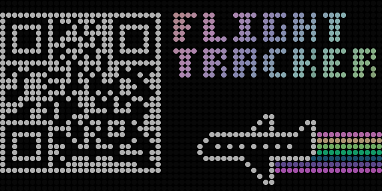

  
<a href="#quick-install" class="text-black">Quick install</a>

  
<a href="#full-install" class="text-black">Full install</a>

  
<a href="#upgrading" class="text-black">Upgrading</a>

  
<a href="#manual-install" class="text-black">Manual install</a>

  
<a href="#simulator" class="text-black">Simulator</a>

<section>
  

    <h2 class="section-title">Getting started</h2>

    

      
You've put everything together using the build instructions and now you're ready to install the software.

    

  

</section>

<section id="quick-install">
  

    <h2 class="section-title">Quick install</h2>

    

        

            
<strong>If you know what you're doing</strong> and you've got a Raspberry Pi you can SSH into, and you're happy for the installer script to treat the system as a fresh install, then you can skip the rest of this page. Pick the script for your hardware and run it:

        

    

    

      

        Raspberry Pi 3 / 4 / Zero
        <button class="code-card-copy" onclick="copyCode(this, 'curl -sSL https://raw.githubusercontent.com/ColinWaddell/FlightTracker/refs/heads/release/v2/platforms/pi/install.sh | bash')">Copy</button>
      

      

        <pre><code>curl -sSL https://raw.githubusercontent.com/ColinWaddell/FlightTracker/refs/heads/release/v2/platforms/pi/install.sh | bash</code></pre>
      

    

    

      

        Raspberry Pi 5
        <button class="code-card-copy" onclick="copyCode(this, 'curl -sSL https://raw.githubusercontent.com/ColinWaddell/FlightTracker/refs/heads/release/v2/platforms/pi5/install.sh | bash')">Copy</button>
      

      

        <pre><code>curl -sSL https://raw.githubusercontent.com/ColinWaddell/FlightTracker/refs/heads/release/v2/platforms/pi5/install.sh | bash</code></pre>
      

    

    

      
Each script installs the appropriate RGB matrix driver for your hardware, clones FlightTracker, sets up the Python environment, and configures a systemd service so it starts on boot. Not sure which Pi you have? Run the Pi 3/4/Zero script - it will detect a Pi 5 and redirect you. You can read the scripts on GitHub before running them: <a href="https://github.com/ColinWaddell/FlightTracker/blob/release/v2/platforms/pi/install.sh">Pi 3/4/Zero</a> · <a href="https://github.com/ColinWaddell/FlightTracker/blob/release/v2/platforms/pi5/install.sh">Pi 5</a>.

      
If you'd rather go step by step - or you're starting from scratch and need to prepare an SD card first - read on.

    

  

</section>

<section id="full-install">
  

    <h2 class="section-title">Preparing the SD card</h2>

    

      
The easiest way to get all the FlightTracker software installed is with a freshly prepared Raspberry Pi. The installer script assumes it's running on a fresh install of Raspberry Pi OS Trixie.

      
These instructions are a walk-through of how to use the Raspberry Pi Imager for those unfamiliar with these tools.

      
First, download and install <a href="https://www.raspberrypi.com/software/">Raspberry Pi Imager</a> on your computer.

      

        
Use a decent quality microSD card with at least <strong>8GB</strong> of space. Cheap cards can cause random crashes and slow installs, and they have a higher chance of randomly dying.

      

      
Stick a microSD card into your computer and open the Imager. The steps are:

      <ol>
        <li><strong>Choose your device</strong> - pick the Raspberry Pi model you're using (3B, 4B, Zero 2, Zero W, etc.).</li>
      </ol>

      

        
Select your device

        

          
        

      

      <ol start="2">
        <li><strong>Choose your OS</strong> - select <em>Raspberry Pi OS (Other)</em> and then <em>Raspberry Pi OS Lite</em>. The Lite version has no desktop environment, which is exactly what we want - FlightTracker runs headless and a desktop would just waste resources. The Imager will show you the correct version for your device. If it offers you a choice between 32-bit and 64-bit, go with 64-bit unless you're on a Pi Zero, in which case choose 32-bit.</li>
      </ol>

      

        
Choose your OS

        

          
        

      

      <ol start="3">
        <li><strong>Choose your storage</strong> - select your microSD card. Double-check you've picked the right one, because everything on it is about to be wiped.</li>
        <li><strong>Edit the settings</strong> - before you write, the Imager will offer to apply OS customisation settings. This is where you set up:
          <ul>
            <li>A <strong>hostname</strong> for your Pi (something like <code>flighttracker</code> makes it easy to find on your network).</li>
            <li>A <strong>username and password</strong> - you'll need these to SSH in later. The quick-installer assumes the username <code>pi</code>.</li>
          </ul>

          

            
Set your username and password

            

              
            

          

          <ul>
            <li><strong>SSH</strong> - under the Services tab, tick <em>Enable SSH</em> and choose <em>Use password authentication</em>. Unless you know what you're doing with SSH keys, password-based login is the simplest way to get going.</li>
            <li>Your <strong>Wi-Fi</strong> details, if you're not using a wired connection.</li>
          </ul>

          

            
Configure Wi-Fi

            

              
            

          

          

            
Enable SSH

            

              
            

          

        </li>
        <li><strong>Write</strong> - hit the button and wait. The Imager writes the image, verifies it, and applies your settings in one go.</li>
      </ol>

      
Once that's done, eject the card, slot it into your Pi, and power it on. Give it a minute or two to boot and join your network, then SSH in from your computer:

    

    

      

        SSH into your Pi
        <button class="code-card-copy" onclick="copyCode(this, 'ssh pi@flighttracker.local')">Copy</button>
      

      

        <pre><code>ssh pi@flighttracker.local</code></pre>
      

    

    

      
If the <code>.local</code> hostname doesn't resolve on your network, you can find the Pi's IP address from your router's admin page and use that instead.

    

  

</section>

<section>
  

    <h2 class="section-title">SSH in and run the installer</h2>

    

      
Now you need to connect to your Pi over SSH and run the installer script. If you've never used SSH before, it's a way to run commands on another computer over the network. The <a href="https://www.raspberrypi.com/documentation/computers/remote-access.html#ssh">Raspberry Pi SSH guide</a> covers installing an SSH client on Windows, macOS, and Linux.

      
Open a terminal (or Command Prompt / PowerShell on Windows) and connect to your Pi using the username and hostname you set in the Imager:

    

    

      

        Connect to your Pi
        <button class="code-card-copy" onclick="copyCode(this, 'ssh pi@flighttracker.local')">Copy</button>
      

      

        <pre><code>ssh pi@flighttracker.local</code></pre>
      

    

    

      
Accept the security prompt (type <code>yes</code> if it asks about a host key), then enter the password you set in the Imager. You won't see the characters as you type - that's normal for SSH.

      
Once you're in, you'll be sitting at a prompt on the Pi. Now run the installer:

    

    

      

        Raspberry Pi 3 / 4 / Zero
        <button class="code-card-copy" onclick="copyCode(this, 'curl -sSL https://raw.githubusercontent.com/ColinWaddell/FlightTracker/refs/heads/release/v2/platforms/pi/install.sh | bash')">Copy</button>
      

      

        <pre><code>curl -sSL https://raw.githubusercontent.com/ColinWaddell/FlightTracker/refs/heads/release/v2/platforms/pi/install.sh | bash</code></pre>
      

    

    

      

        Raspberry Pi 5
        <button class="code-card-copy" onclick="copyCode(this, 'curl -sSL https://raw.githubusercontent.com/ColinWaddell/FlightTracker/refs/heads/release/v2/platforms/pi5/install.sh | bash')">Copy</button>
      

      

        <pre><code>curl -sSL https://raw.githubusercontent.com/ColinWaddell/FlightTracker/refs/heads/release/v2/platforms/pi5/install.sh | bash</code></pre>
      

    

    

      
The script walks through the whole install: the RGB matrix driver appropriate for your hardware, the FlightTracker code, the Python environment, and a systemd service so it starts automatically on boot. This can take anywhere from a few minutes on newer systems to half an hour or so on older Pi models.

      
When it's done, the Pi will reboot and FlightTracker will start up. The first boot can take a few minutes before everything is running. If you're concerned something isn't right, SSH in and run <code>sudo systemctl status FlightTracker.service</code> to see what's going on.

      
On boot, FlightTracker shows a QR code on the matrix - scan it with your phone to open the web configuration UI. You can also access the settings directly in a browser at <code>http://flighttracker.local:8584</code> (using the hostname you set in the Imager) or <code>http://&lt;your-pi-ip&gt;:8584</code>.

      

        

            
        

       
First boot - scan to configure

      

      
If anything goes wrong, the manual install steps are in the platform-specific folders on GitHub: <a href="https://github.com/ColinWaddell/FlightTracker/tree/release/v2/platforms/pi"><code>platforms/pi</code></a> and <a href="https://github.com/ColinWaddell/FlightTracker/tree/release/v2/platforms/pi5"><code>platforms/pi5</code></a>. You can also <a href="https://github.com/ColinWaddell/FlightTracker/issues">raise an issue</a> if you get stuck.

    

    

        

      <h2 class="section-title" id="upgrading">Upgrading from FlightTracker v1 to v2</h2>

      

        I'd recommend a clean install by wiping your SD card and starting from scratch. If that's not an option, you should be able to stop the current code from running and swap out the source code
        for the latest version.
      

      

        If you've customised the code, you're probably going to have a bad time trying to update in place,
        as a huge amount has been rewritten between v1 and v2.
      

      

        If you've got a clear path to upgrade then the code will port across your <code>config.py</code>
        to a <code>config.json</code> automatically on the first boot.
      

      
Before proceeding make sure you stop the FlightTracker from running:

      

        

          Stop the running service
          <button class="code-card-copy" onclick="copyCode(this, 'sudo systemctl stop FlightTracker.service')">Copy</button>
        

        

          <pre><code>sudo systemctl stop FlightTracker.service</code></pre>
        

      

      <h3>You installed the original from a zip file</h3>

      

        If you originally downloaded FlightTracker as a zip file from GitHub and extracted it into
        <code>/home/pi/FlightTracker</code>, the folder won't be a git repository so you can't pull
        updates. The cleanest approach is to remove the old source code and clone the latest version
        in its place.
      

      

        Since the folder isn't a git repository you can't pull updates, but you can swap out the
        source code by hand while keeping your existing virtual environment and settings. Back up
        your <code>config.py</code>, clear out everything except the <code>env</code> directory,
        drop in the latest source from GitHub, refresh the dependencies, restore your config and
        restart the service:
      

      

        

          Update from a zip download, preserving settings
          <button class="code-card-copy" onclick="copyCode(this, 'cp /home/pi/FlightTracker/config.py /tmp/config.py.backup\n\ncd /home/pi/FlightTracker\nfind . -maxdepth 1 -not -name \'env\' -not -name \'.\' -exec rm -rf {} +\n\ncurl -sSL https://github.com/ColinWaddell/FlightTracker/archive/refs/heads/release/v2.zip -o /tmp/FlightTracker.zip\nunzip -q /tmp/FlightTracker.zip -d /tmp/FlightTracker-src\ncp -r /tmp/FlightTracker-src/FlightTracker-release-v2/. /home/pi/FlightTracker/\n\nsource env/bin/activate\npip install -r requirements.txt\n\ncp /tmp/config.py.backup /home/pi/FlightTracker/config.py\n\nsudo systemctl restart FlightTracker.service')">Copy</button>
        

        

          <pre><code>cp /home/pi/FlightTracker/config.py /tmp/config.py.backup

cd /home/pi/FlightTracker
find . -maxdepth 1 -not -name 'env' -not -name '.' -exec rm -rf {} +

curl -sSL https://github.com/ColinWaddell/FlightTracker/archive/refs/heads/release/v2.zip -o /tmp/FlightTracker.zip
unzip -q /tmp/FlightTracker.zip -d /tmp/FlightTracker-src
cp -r /tmp/FlightTracker-src/FlightTracker-release-v2/. /home/pi/FlightTracker/

source env/bin/activate
pip install -r requirements.txt

cp /tmp/config.py.backup /home/pi/FlightTracker/config.py

sudo systemctl restart FlightTracker.service</code></pre>
        

      

      

        On first boot the new code will port your <code>config.py</code> across to a
        <code>config.json</code> automatically.
      

      <h3>You installed the original using git clone</h3>

      

        If you originally cloned the repository with <code>git clone</code>, upgrading is
        straightforward. Move into your existing checkout and pull down the latest changes:
      

      

        

          Pull the latest code
          <button class="code-card-copy" onclick="copyCode(this, 'cd /home/pi/FlightTracker\ngit fetch --all\ngit checkout release/v2\ngit pull')">Copy</button>
        

        

          <pre><code>cd /home/pi/FlightTracker
git fetch --all
git checkout release/v2
git pull</code></pre>
        

      

      

        If you have local modifications, the <code>git pull</code> may complain about conflicts. Stash
        your changes first, pull, then decide whether you still need them - remember a huge amount has
        been rewritten between v1 and v2:
      

      

        

          Stash local changes before pulling
          <button class="code-card-copy" onclick="copyCode(this, 'cd /home/pi/FlightTracker\ngit stash\ngit checkout release/v2\ngit pull')">Copy</button>
        

        

          <pre><code>cd /home/pi/FlightTracker
git stash
git checkout release/v2
git pull</code></pre>
        

      

      

        Your existing <code>config.py</code> sits at the top level of the checkout and won't be
        touched by the pull. Once the new code is in place, refresh the Python dependencies and
        reinstall the systemd service. On first boot your <code>config.py</code> will be migrated to
        <code>config.json</code> automatically.
      

      

        

          Refresh dependencies and reinstall the service
          <button class="code-card-copy" onclick="copyCode(this, 'cd /home/pi/FlightTracker\nsource env/bin/activate\npip install -r platforms/pi/requirements.txt\n\nsudo systemctl restart FlightTracker.service')">Copy</button>
        

        

          <pre><code>cd /home/pi/FlightTracker
source env/bin/activate
pip install -r requirements.txt

sudo systemctl restart FlightTracker.service</code></pre>
        

      

    

  

</section>
<section id="simulator">
  

    <h2 class="section-title">Running the simulator</h2>

    

      

        If you don't have a Raspberry Pi or LED panel handy, FlightTracker can run entirely on your
        desktop or laptop. When the hardware display drivers (piomatter for Pi 5, rgbmatrix for
        Pi 3/4) aren't available, the app automatically falls back to a pygame-based simulator that
        renders the LED matrix in a window on your screen.
      

      

        This is useful for development, testing configuration changes, or just seeing what the
        software looks like before you commit to building the full hardware.
      

      <h3>Setup</h3>

      

        You'll need Python 3.10 or newer. Clone the repo, create a virtual environment, and install
        the simulator dependencies:
      

      

        

          Linux / macOS
          <button class="code-card-copy" onclick="copyCode(this, 'git clone https://github.com/ColinWaddell/FlightTracker\ncd FlightTracker\npython3 -m venv env\nsource env/bin/activate\npip install -r platforms/simulator/requirements.txt')">Copy</button>
        

        

          <pre><code>git clone https://github.com/ColinWaddell/FlightTracker
cd FlightTracker
python3 -m venv env
source env/bin/activate
pip install -r platforms/simulator/requirements.txt</code></pre>
        

      

      

        

          Windows
          <button class="code-card-copy" onclick="copyCode(this, 'git clone https://github.com/ColinWaddell/FlightTracker\ncd FlightTracker\npython -m venv env\nenv\\Scripts\\activate\npip install -r platforms/simulator/requirements.txt')">Copy</button>
        

        

          <pre><code>git clone https://github.com/ColinWaddell/FlightTracker
cd FlightTracker
python -m venv env
env\Scripts\activate
pip install -r platforms/simulator/requirements.txt</code></pre>
        

      

      <h3>Running</h3>

      

        Launch it the same way you would on a Pi:
      

      

        

          Linux / macOS
          <button class="code-card-copy" onclick="copyCode(this, 'env/bin/python3 flight-tracker.py')">Copy</button>
        

        

          <pre><code>env/bin/python3 flight-tracker.py</code></pre>
        

      

      

        

          Windows
          <button class="code-card-copy" onclick="copyCode(this, 'env\Scripts\python.exe flight-tracker.py')">Copy</button>
        

        

          <pre><code>env\Scripts\python.exe flight-tracker.py</code></pre>
        

      

      

        A pygame window opens showing the simulated LED matrix. The app runs exactly as it would on
        a Pi, including the web configuration interface at
        <a href="http://localhost:8584"><code>http://localhost:8584</code></a>.
      

      <h3>Capture keys</h3>

      

        The simulator supports saving screenshots and video frame sequences — handy for creating
        the kind of capture clips you see on the home page:
      

      <ul>
        <li><strong>P</strong> — Save a photo to <code>captures/</code></li>
        <li><strong>R</strong> — Toggle video recording on/off (saves a PNG frame sequence to <code>captures/</code>)</li>
      </ul>

      

        Full setup details are in the
        <a href="https://github.com/ColinWaddell/FlightTracker/blob/release/v2/platforms/simulator/INSTALL.md">simulator install guide</a>
        on GitHub.
      

    

  

</section>
